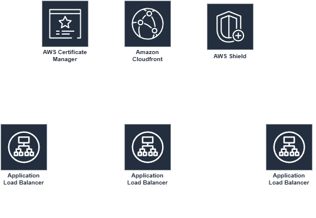
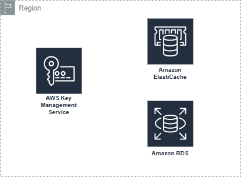
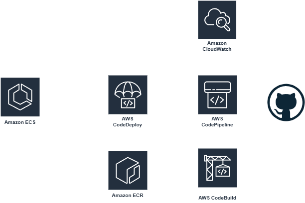

## Containerized Microservices with ECS Fargate and Service Discovery

### Table of content
- [Solution Overview](#solution-overview)
- [Application's constrains and requirements](#the-application-constrains-and-requiremnts)
- [Design Aspects Details](#design-aspects-details)
    - [Security](#security)
    - [Pipeline Flow](#operational-excellence)
    - [Monitoring Flow](#performance-efficiency)
    - [Reliability](#reliability)
    - [Networking Layer](#networking-layer)

### Solution Overview
This is a training personal project with objective of migrate a monolithic Node.js application into three microservices — Auth, Orders, and Notifications.

### architecture overview diagram

#### The application constrains and requiremnts
- The apps is statefull.
- The operatability needs to be at minimum efforts.
- The comminication needs to be secure.
- The deployment needs to support blue/green deployment
- The project need to adhere to `AWS Well Architected Framework`

### Design Aspects Details
this section is for the details of each aspect used in the over view diagram but in more details

#### Security

- Edge protection: AWS Certificate Manager issues the TLS certificate used by CloudFront, and AWS Shield provides DDoS protection at the edge before traffic ever reaches the VPC.
- Network segmentation: the ALB sits in public subnets with a security group that only allows inbound 443 from the internet. Each of the three services (Auth, Orders, Notifications) runs in private subnets with a security group that only accepts traffic from the ALB's security group on the task's listener port — no service is reachable directly from the internet.
- Least-privilege IAM: each ECS task uses two separate IAM roles — a task execution role (used by the ECS agent to pull images from ECR, fetch secrets, and write logs) and a task role (used by the application code at runtime to call other AWS services, e.g. publishing to SNS). Keeping these separate avoids over-granting permissions to application code.
- Secrets management: database credentials and third-party API keys are stored in AWS Secrets Manager and injected into the container at task startup via the execution role — nothing is hardcoded or baked into the image.
- Image integrity: Amazon ECR has vulnerability scanning on push enabled, so images with known CVEs are flagged before they can be deployed.
- Encryption: RDS is encrypted at rest with KMS, and ElastiCache Redis has both in-transit and at-rest encryption enabled, since it's shared session storage across all three services.

#### Pipeline Flow

CI/CD is built around CodePipeline with an ECS blue/green deployment through CodeDeploy:

- A push to GitHub triggers AWS CodePipeline.
- AWS CodeBuild builds the Docker image, runs the test suite, and pushes the image to Amazon ECR (where it's also scanned for vulnerabilities).
- AWS CodeDeploy takes over the ECS deployment using the blue/green strategy:
    - The current live task set (BLUE) keeps serving 100% of production traffic on the ALB's production listener.
    - The new task set (GREEN) is deployed alongside it and registered to a test listener, so it can be validated before receiving real traffic.
    - CloudWatch Alarms (5xx error rate, latency, CPU/memory) watch the GREEN task set during a bake-time window.
    - If the alarms stay healthy, CodeDeploy shifts production traffic from BLUE to GREEN and drains/terminates the old BLUE tasks.
    - If any alarm trips, CodeDeploy automatically rolls back: production traffic stays on (or reverts to) BLUE, the GREEN task set is terminated, and an SNS topic notifies the on-call channel of the failed deployment.

This gives zero-downtime deploys with an automatic safety net, rather than relying on manual rollback.
#### Monitoring Flow
- AWS X-Ray is instrumented in all three services (Auth, Orders, Notifications), so a single request can be traced end-to-end across service boundaries. X-Ray builds a service map, making it easy to spot which service is introducing latency or errors in a call chain.
- CloudWatch Logs collects application and access logs from each service; CloudWatch Metrics/Dashboards aggregate CPU, memory, request count, and error rate per service.
- CloudWatch Alarms are set on the key health metrics. When triggered, they publish to an SNS "Ops Alerts" topic, which is intentionally kept separate from the application-level Notifications-service SNS topic to avoid mixing operational alerts with user-facing notification events.
- The same alarms also feed into CodeDeploy, gating blue/green traffic shifts and triggering automatic rollback (see Pipeline Flow) — so monitoring isn't just passive dashboards, it's directly wired into deployment safety.
#### Reliability
- Multi-AZ compute: all three services run Fargate tasks across two Availability Zones, so the loss of a single AZ doesn't take a service down. ECS Service Auto Scaling uses target-tracking (CPU/memory) to scale tasks in and out, and the ALB's health checks automatically stop - routing to unhealthy tasks and let ECS replace them.
Multi-AZ data tier: Amazon RDS runs in Multi-AZ mode with a synchronously-replicated standby, enabling automatic failover. ElastiCache for Redis runs as a replication group (primary + replica across AZs) with automatic failover for the shared session cache.
- Deployment safety net: CodeDeploy's blue/green rollout with CloudWatch-alarm-gated automatic rollback (see Pipeline Flow) prevents a bad deploy from becoming an outage.
- No server management overhead: since everything runs on Fargate, there's no EC2 patching, capacity planning, or cluster scaling to manage directly — AWS handles the underlying compute lifecycle, which keeps operational effort low (per the project's constraint).
### Networking layer
- Public subnets (one per AZ) host the Application Load Balancer and a NAT Gateway. An Internet Gateway attached to the VPC gives the public subnets internet reachability, and CloudFront sits in front of the ALB at the edge.
- Private subnets (one per AZ) host the ECS Fargate tasks for all three services, along with RDS and ElastiCache — none of these are directly internet-routable.
- Egress from private subnets (e.g., pulling container images, calling third-party APIs) goes out through the NAT Gateway in the same AZ, keeping the compute and data tier off the public internet while still allowing outbound calls.
- Each subnet tier has its own route table: public subnets route `0.0.0.0/0` to the Internet Gateway, private subnets route `0.0.0.0/0` to the NAT Gateway in the same AZ.