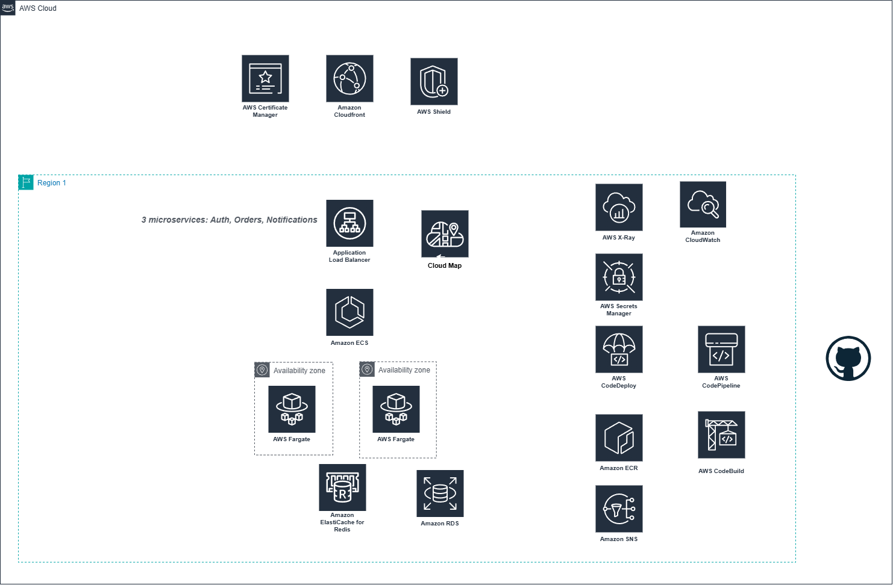

## Containerized Microservices with ECS Fargate and Service Discovery

### Table of content
- [Solution Overview](#solution-overview)
- [Application's constrains and requirements](#the-application-constrains-and-requiremnts)
- [Design Aspects Details](#design-aspects-details)
    - [Security](#security)
    - [Pipeline Flow](#operational-excellence)
    - [Monitoring Flow](#performance-efficiency)
    - [Reliability](#reliability)
    - [Networking Layer](#networking-layer)

### Solution Overview
This is a training personal project with objective of migrate a monolithic Node.js application into three microservices — Auth, Orders, and Notifications.

### architecture overview diagram

#### The application constrains and requiremnts
- The apps is statefull.
- The operatability needs to be at minimum efforts.
- The comminication needs to be secure.
- The deployment needs to support blue/green deployment
- The project need to adhere to `AWS Well Architected Framework`

### Design Aspects Details
this section is for the details of each aspect used in the over view diagram but in more details

#### Security
#### Pipeline Flow
#### Monitoring Flow
#### Reliability
### Networking layer
